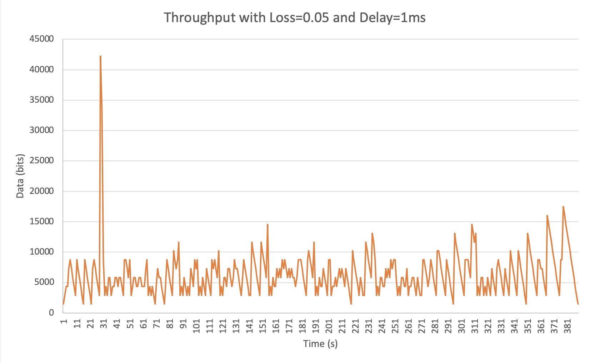

# project2-daniel-aisha
CSS Project 2 - Transmission Control Protocol

## How to Run:

* ./rdt_sender 127.0.0.1 9000 <FILE_TO_SEND>
* ./rdt_reciever 9000 <FILE_TO_SAVE>

## Running with Mahi-Mahi

Although it is not necessary for checkpoint one of this project, the code does work with Mahi-Mahi. 

To run, simply type <code>echo $MAHIMAHI_BASE</code> into your terminal. This will give you the Mahi-Mahi base IP address. Use this IP instead of the localhost 127.0.0.1 IP.

You can add delay (mm-delay <amount in ms>) or packet loss (mm-loss uplink/downlink <proportion delay>).
  
# Checkpoint 2:

Images:

