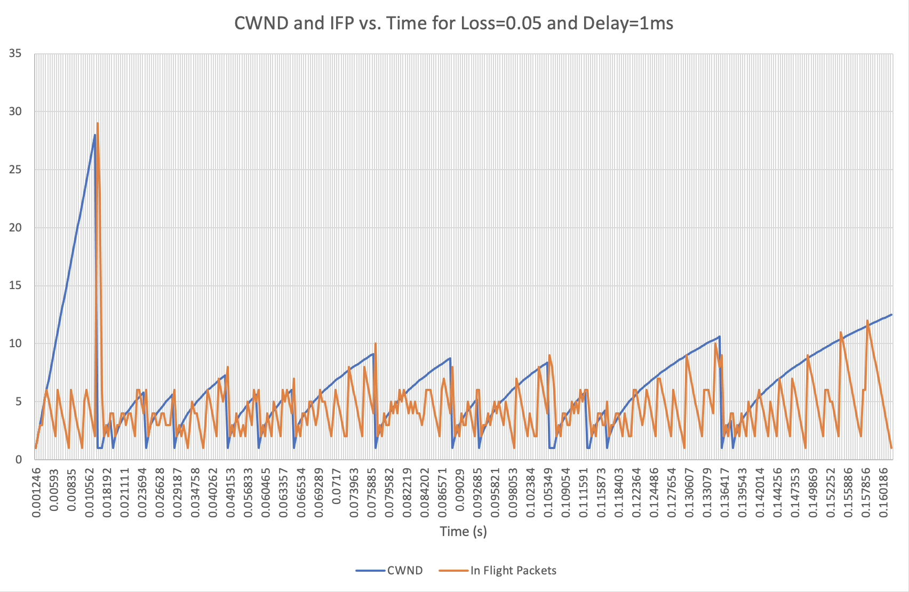
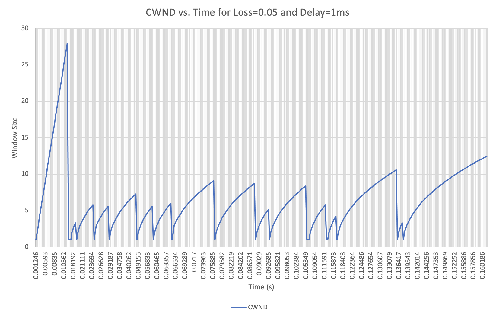
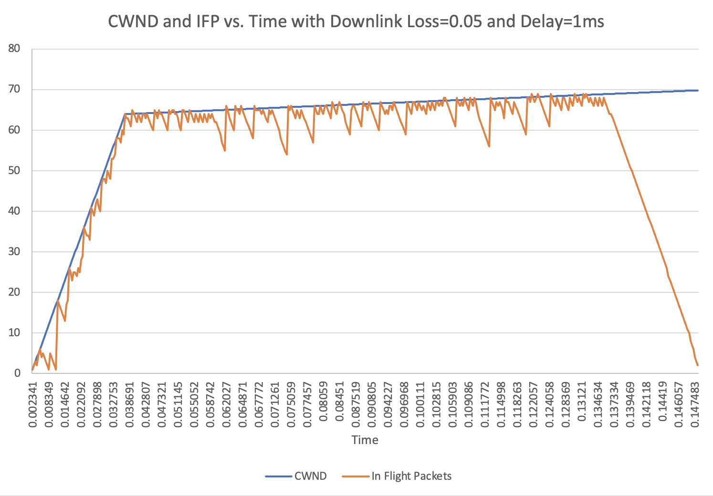
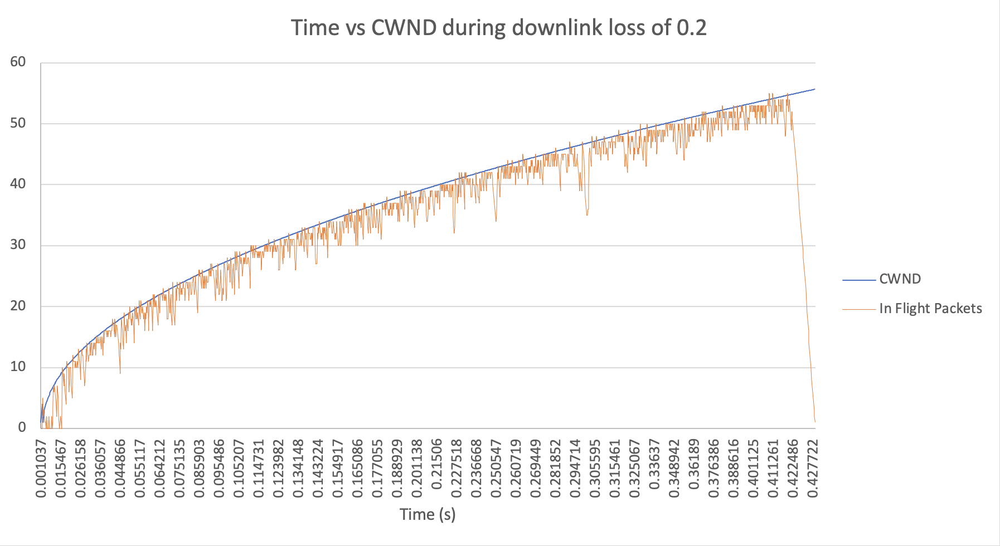
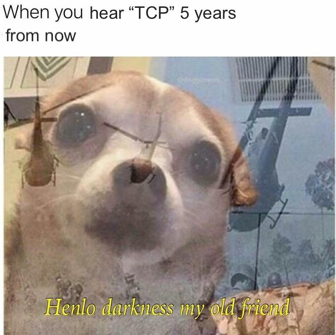

# project2-daniel-aisha
CSS Project 2 - Transmission Control Protocol

## Checkpoint 1:

### How to Run:

* ./rdt_sender 127.0.0.1 9000 <FILE_TO_SEND>
* ./rdt_reciever 9000 <FILE_TO_SAVE>

### Running with Mahi-Mahi

Although it is not necessary for checkpoint one of this project, the code does work with Mahi-Mahi. 

To run, simply type <code>echo $MAHIMAHI_BASE</code> into your terminal. This will give you the Mahi-Mahi base IP address. Use this IP instead of the localhost 127.0.0.1 IP.

You can add delay (mm-delay <amount in ms>) or packet loss (mm-loss uplink/downlink <proportion delay>).
  
## Checkpoint 2:

### How to Run:

To run, navigate to starterCode file and type in <code>make</code>. Then you can naviate to obj file and: 

* ./rdt_sender 127.0.0.1 9000 <FILE_TO_SEND>
* ./rdt_reciever 9000 <FILE_TO_SAVE>

### Output

The output will be stored to a csv file called cwnd_output.csv. It will contain the time, the congestion window and the number of in flight packets.

### Graphs

## Meme:

While the project was educational and fun, we spent a lot of time and effort on it. This meme is a tribute to our struggle. 

